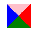
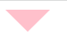

# **HTML**

#### 什么是HTML

- 超文本标记语言 (英语：**H**yper**t**ext **M**arkup **L**anguage，简称：HTML ) 是一种用来结构化 Web 网页及其内容的标记语言。
- HTML 由一系列的**元素（[elements](https://developer.mozilla.org/zh-CN/docs/Glossary/Element)）**组成，这些元素可以用来包围不同部分的内容，使其以某种方式呈现或者工作。

#### 语义化

- 对语义化的理解
  - 正确的标签做正确的事
  - web语义化是指通过HTML标记表示页面所包含的新的，其中包括HTML标签的语义化和CSS命名的语义化。
  - HTML语义化
    - 使用包含语义的标签如(h1-h6)恰当的表示文档结构
  - CSS命名语义化
    - 为html标签添加有意义的class，id来补充未表达的语义
- 语义化的好处
  - 去掉样式后，页面也能呈现清晰的结构
  - 盲人使用读屏器更好地阅读
  - 方便 SEO
  - 方便项目团队的开发与维护

#### 标签类型

- 块级元素
  - 块级元素占据其父元素（容器）的整个宽度，因此创建了一个“块”。
  - 常见的块级元素：div,ol,ul,li,h1-h6,p
- 行内元素
  - 一个行内元素只占据它对应标签的边框所包含的空间。
  - 常见的行内元素有 a b span img strong sub sup button input label select textarea
- 空元素
  - 标签内没有内容的 HTML 标签被称为空元素。空元素是在开始标签中关闭的。
  - 常见的空元素有：br hr img input link meta

#### link 标签

- `link`  标签定义文档和外部资源的关系
- link 元素是空元素，它仅包含属性。
- 该元素只能存在于head部分
- 常见的作用就是加载一个css样式表

#### img标签

- img标签支持的格式
  - png | jpg  | gif | Svg | Webp(谷歌发明的一种图片压缩格式)
- img标签中的alt 和title的区别
  - title 是当鼠标悬停到图片上显示的文字
  - alt 是< img>所特有的属性，主要用于当图片加载失败时显示的文字，搜索引擎会重点分析。
  - alt是必需属性（但属性值可为空），title非必需
- `src` 属性是**必须的**，它包含了你想嵌入的图片的文件路径。

#### label标签

- label标签主要是方便鼠标点击使用，扩大可点击的范围，增强用户操作体验

#### b 与 strong 的区别和 i 与 em 的区别？

- 从页面显示的效果来看，< b> 和< strong>都会将文字加粗 < i>和< em>都会将文字以斜体的方式展示文字
- < b>,< i> 是自然样式的标签 < strong>< em>是语义化的标签

####  iframe 有那些缺点？

-  iframe 元素会创建包含另外一个文档的内联框架（即行内框架）。
- 优点： 
  - 解决加载缓慢的第三方内容如图标和广告等的加载问题 
  - Security sandbox 
  - 并行加载脚本
-  缺点： 
   - iframe 会阻塞主页面的 Onload 事件
   - 即时内容为空，加载也需要时间
   - 没有语意

####  meta 标签

-  < meta> 元素可提供有关页面的元信息（meta-information），比如针对搜索引擎和更新频度的描述和关键词。

- ```html
  <meta charset="utf-8">    声明文档使用的字符编码
  <meta http-equiv="X-UA-Compatible" content="IE=edge,chrome=1"/>   优先使用 IE 最新版本和 Chrome
  <meta name="description" content="不超过150个字符"/>       页面描述
  <meta name="keywords" content=""/>      页面关键词者
  <meta name="viewport" content="initial-scale=1, maximum-scale=3, minimum-scale=1, user-scalable=no"> 为移动设备添加 viewport
  ```

#### HTML5新增的特性

- 绘画 canvas;
- 用于媒介回放的 video 和 audio 元素;
-  本地离线存储 localStorage 长期存储数据，浏览器关闭后数据不丢失;
- sessionStorage 的数据在浏览器关闭后自动删除;
- 语意化更好的内容元素，比如 article、footer、header、nav、section;
- 表单控件，calendar、date、time、email、url、search;
- 新的技术 webworker, websocket;
-  新的文档属性 document.visibilityState 

# **CSS**

#### 什么是CSS

- CSS(层叠样式表) 是用来指定文档如何展示给用户的一门语言——如网页的样式、布局、等等。
- CSS 可以用于给文档添加样式 —— 比如改变标题和链接的[颜色](https://developer.mozilla.org/zh-CN/docs/Web/CSS/color_value)及[大小](https://developer.mozilla.org/zh-CN/docs/Web/CSS/font-size)。它也可用于创建布局 —— 比如将一个单列文本变成包含主要内容区域和存放相关信息的侧边栏区域的[布局](https://developer.mozilla.org/zh-CN/docs/Web/CSS/Layout_cookbook/Column_layouts)。它甚至还可以用来做一些特效，比如[动画](https://developer.mozilla.org/zh-CN/docs/Web/CSS/CSS_Animations)。

#### **说一下盒模型**

- 盒子模型（IE和W3C标准）都是由四部分组成，内容(content)，填充(padding),边距(margin),边框(border)四个部分组成
- 标准的盒子模型 ： 属性width,height只包括内容，不包括border和padding
- IE的盒子模型： 属性width,height包括content，padding，border。
- 我们也可以使用css3新增的box-sizing属性来更改元素盒模型

####  **css选择器**

- 选择器类型
  
  - ```html
    （1）id选择器（#myid）
    （2）类选择器（.myclassname）
    （3）标签选择器（div,h1,p）
    （4）后代选择器（h1 p）
    （5）相邻后代选择器（子）选择器（ul>li）
    （6）兄弟选择器（li~a）
    （7）相邻兄弟选择器（li+a）
    （8）属性选择器（a[rel="external"]）
    （9）伪类选择器（a:hover,li:nth-child）
    （10）伪元素选择器（::before、::after）
    （11）通配符选择器（*）
    ```
- 通配符选择器

  - ```
     * {
     margin : 0;
     }
    ```
 - 标签选择器

   - ```css
     a {
       color : red;
     }
     
     <a>hello world </a>
     ```

 - 类选择器

   - ```css
     .abc {
         width: 100px; 
     }
     
     <div class="abc"></div>
     ```

 - id选择器

   - ```css
     #abc {
         width: 100px;
     }
     
     <div id="abc"></div>
     ```

- 后代选择器

  - ```css
    .aaa span{
        color: red;
    }
    
    <div class="aaa">
    	<span> abc</span>
    </div>
    ```

- 子元素选择器

  - 子元素选择器只能选择作为某元素的最近一级子元素。

  - ```css
     .abc > a {
      color: red;
     }
      
    <div class="abc">
        <a href="#"></a>
        <p>
          <a href="#"></a>
        </p>
    </div>
    
    ```

- 并集选择器

  - ```css
    div,span {
        color: red;
    }
    
    <div class="abc"></div>
    <span>aaa</span>
    ```
  
- 伪类选择器

  - ```css
    <a href="#"></a>
    
    a:link {}  选择所有未被访问的链接
    
    a:visited {} 选择所有已经被访问的链接
    
    a:hover {} 选择鼠标指针位于其上的链接
    
    a:active {} 选择鼠标按下未弹起的链接
    ```

  - **注意事项**：为确保生效应该按照`LVHA`的顺序进行声明编写

- 伪元素选择器

  - ```css
    .a::after {
    	content: " ";
    	width: 10px;
    	height: 10px;
    }
    <div class="a"></div>
    ```

  - **伪类必须包含content属性**

#### 伪类和伪元素

- 在css3中使用单冒号来表示伪类，用双冒号来表示伪元素。但是为了兼容已有的伪元素的写法，在一些浏览器中也可以使用单冒号来表示伪元素
- 伪类一般匹配的是元素的一些**特殊状态**如：hover, link 等
- 伪元素一般匹配是元素的**特殊位置**比如 after before等
  - 伪元素在页面效果是可见的，但是创建时并不会在文档树里面


#### 关于伪类LHVA

- a标签有四种 状态访问前，访问后，鼠标滑过，激活。分别对应 :link :visited :hover :active
- 链接未访问：
  - 鼠标滑过链接时，满足了link，hover状态，要改变颜色，就必须将: hover放在: link后面声明
  - 鼠标点击激活a链接，满足了link，hover,active 三种状态，要显示active的样式只能将active声明放在link,hover后面。
- 链接访问过： 情况基本同上，只不过需要将:link换成:visited
- 顺序可不可以变化：
  - 可以，但也只有:link和:visited可以交换位置，因为一个链接要么访问过要么没访问过，不可能同时满足，也就不存在覆盖的问题。

#### css属性继承

- 每一个属性在定义中都给出了这个属性是否具有继承性，一个具有继承性的属性在没用指定的时候，会使用父元素的同属性的值来作为自己的值
- 具有继承属性：
  - 字体相关 font-size font-weight 等
  - 文本相关 color和text-align 等
  - 列表属性 list-style 等
  - 光标属性 cursor 
  - 元素可见 visibility
- 当一个属性不是继承属性时，我们也可以通过设置属性值为inherit使它从父元素获取同名属性值

#### **css权重与优先级**

- 当同一个元素上有多个指定的选择器，就会产生优先级

- 权重是由4组数据构成的

  - |        选择器        | 选择器权重 |
    | :------------------: | :--------: |
    | 继承 或者 通配符 (*) | 0，0，0，0 |
    |      元素选择器      | 0，0，0，1 |
    | 类选择器 伪类选择器  | 0，0，1，0 |
    |       ID选择器       | 0，1，0，0 |
    |       行内样式       | 1，0，0，0 |
    |     ！important      |   无穷大   |

  - **继承的权重为 0** 如果该元素没有被直接选中，不管父亲权重有多高，子类得到的权重都是0


#### **css水平、垂直居中的写法，请至少写出4种？**

+ *水平居中*
  + 行内元素: `text-align: center`
  + 块级元素: `margin: 0 auto`
  + `position:absolute` +left:50%+ `transform:translateX(-50%)`
  + `display:flex + justify-content: center`
+ *垂直居中*
  + 设置line-height 等于height
  + `position：absolute` +top:50%+ `transform:translateY(-50%)`
  + `display:flex + align-items: center`
  + display:table+display:table-cell + vertical-align: middle;

#### **1rem、1em、1vh、1px各自代表的含义？**

- > rem

  - rem是全部的长度都相对于根元素<html>元素。通常做法是给html元素设置一个字体大小，然后其他元素的长度单位就为rem。
  
- > em

  - 子元素字体大小的em是相对于父元素字体大小
  - 元素的width/height/padding/margin用em的话是相对于该元素的font-size

- > vw/vh

  全称是 Viewport Width 和 Viewport Height，视窗的宽度和高度，相当于 屏幕宽度和高度的 1%，不过，处理宽度的时候%单位更合适，处理高度的 话 vh 单位更好。

- > px

  px像素（Pixel）。相对长度单位。像素px是相对于显示器屏幕分辨率而言的。

- 

#### **画一个三角形？**

- 原理：

  - 由于css的边框是由四个三角组成的，我们画一个三角形可以让边框的三个位置的颜色变得透明

  - 实现

    ```css
    .a{
        width: 0;
        height: 0;
        border-width: 100px;
        border-style: solid;
        border-color: transparent #0099CC transparent transparent;
        transform: rotate(90deg); /*顺时针旋转90°*/
     }
    <div class="a"></div>
    ```

  - 效果

    
    
    

#### **清除浮动**的几种方式，及原理？

- > 为什么要清除浮动

  - 由于父盒子很多情况下，不方便给高度，但是子盒子浮动由不占有位置，最后父盒子的高度变成了0，就会影响标准流的盒子

- > 清除浮动方法

  1. 额外标签法：
     - 给浮动元素的末尾添加一个空的标签
     - 注意 这个元素必须是块级的标签
  2. 父级添加`overflow`：
     - 创建父级 `BFC`(overflow:hidden)
  3. `::after`伪元素法
  5. 父级设置高度
  
- > *BFC （*块级格式化上下文*）*，是一个独立的渲染区域，让处于 `BFC` 内部的元素与外部的元素相互隔离，使内外元素的定位不会相互影响。

  *触发条件:*

  - 根元素

  - `position: absolute/fixed`

  - `display: inline-block / table`

  - `float` 元素

  - `ovevflow !== visible`

- *规则:*

    - 属于同一个 `BFC` 的两个相邻 `Box` 垂直排列
- 属于同一个 `BFC` 的两个相邻 `Box` 的 `margin` 会发生重叠
    - `BFC` 的区域不会与 `float` 的元素区域重叠
    - 计算 `BFC` 的高度时，浮动子元素也参与计算
    - 文字层不会被浮动层覆盖，环绕于周围
    

#### display:none 和 visibility:hidden的区别

- display:none，
  - 渲染树不会包括该渲染对象，因此不会在页面中占据位置，也不会绑定监听事件
  - 是非继承属性，子孙节点消失是由于元素从渲染树消失，更改子孙节点的属性也无法显示。
  - 修改display属性通常会造成文档的重排(reflow)和重绘(repaint)
- visibility：hidden，
  - 元素在页面仍然会占据空间，但是不会响应绑定事件
  - 继承属性，子节点默认继承了父节点的属性，更改成visibility：visible可以让节点显示
  - 修改visibility属性只会造成文档的重绘(repaint)

#### **css3新的特性？**

- RGBA和透明度

  - 是RGB颜色模型的一个扩展。本质上，在设置元素中添加了一个alpha通道，即一个表示除红色、绿色和蓝色三种颜色之外的透明度的通道。

- background属性

  - background-image：设置元素的背景图像。
  - background-origin：规定背景图片的定位区域。
  - background-size ：规定背景图片的尺寸。
  - background-repeat：设置是否及如何重复背景图像。

- word-wrap属性

  - word-wrap 属性允许长单词或 URL 地址换行到下一行。

- text-shadow属性

  - 向文本设置阴影。

- **border-radius属性**

  - 该属性允许您为元素添加圆角边框！

  - 基础用法

    ```css
    border-radius: 50%;
    ```

 - **box-shadow属性**

   - box-shadow属性：向框添加一个或多个阴影。（盒阴影）

#### **calc**, support, **media**各自的含义及用法？

- @support主要是用于检测浏览器是否支持CSS的某个属性，其实就是条件判断，如果支持某个属性，你可以写一套样式，如果不支持某个属性，你也可以提供另外一套样式作为替补。
- calc() 函数用于动态计算长度值。 calc()函数支持 "+", "-", "*", "/" 运算；
- @media 查询，你可以针对不同的媒体类型定义不同的样式。

# **JS基础**

#### JS的数据类型

- js中一共有七种基本数据类型：（考虑ES6）
  - Undefined、Null、Boolean、Number、String
  - ES6新增了Symbol，BigInt
- 一种复杂数据类型：Object
  - 如 Array、Date 等数据类型都可以理解为 Object 类型的子类

#### null和undefined的区别

- null和undefined都是基本数据类型
- undefined代表是未定义，一般变量声明了但还没有定义的时候会返回 undefined
- null表示空对象，主要用于赋值给一些可能会返回对象的变量，作为初始化。
- typeof  null 会返回 “Object”
- `null == undefined  => true`
- `null === undefined  => false`

#### 什么是BOM，DOM

- DOM是值文档对象模型，它是指把文档当作一个对象来对待。DOM 是载入到浏览器中的文档模型，以节点树的形式来表现文档，每个节点代表文档的构成部分
  - **常用的对象或方法**： document.append(增加一个元素)，document.querySelector(查找一个元素)，document.addEventListener(事件监听)
- BOM是指浏览器对象模型，它是指将浏览器当作一个对象来对待，这个对象主要定义了与浏览器进行交互的法和接口。
  - BOM的核心是 window，而 window 对象具有双重角色，它既是通过 js 访问浏览器窗口的一个接口，又是一个 Global（全局）对象。
  - **常用的对象或方法**： location 对象、navigator 对象、screen 对象 window.alert(),`window.setTimeout()` **setTimeOut是是浏览器实现的方法**

#### == 操作符的强制类型转换规则

- 1. 字符串和数字之间相比较时，将字符串转换成数字之后比较
  2. 其他类型与Boolean值比较时，先将Boolean值转换成数字，再比较
  3. null和undefined相比较时，结果为**true**，其他值和他们比较时都为**false**
  4. 一个操作值为NaN，则全部返回**false**，NaN== NaN ==> **false**
  5. 当比较两个对象时，比较的是他们的引用是不是指向的是同一个对象

#### 说一下闭包？

- 闭包的实质是因为函数嵌套而形成的作用域链
- 闭包的定义即：函数 `A` 内部有一个函数 `B`，函数 `B` 可以访问到函数 `A` 中的变量，那么函数 `B` 就是闭包
#### 数据类型转换

- | 数据类型  | 转换为true的值 | 转换为false的值 |
  | --------- | -------------- | --------------- |
  | Boolean   | true           | false           |
  | String    | 非空字符串     | 空字符串        |
  | Number    | 任何非零数字值 | 0和NaN          |
  | Object    | 任何对象       | null            |
  | undefined |                | undefined       |

####  instanceof 的作用，与typeof

- instanceof 运算符用于判断构造函数的 prototype 属性是否出现在对象的**原型链中**的任何位置
- typeof判断所有变量的类型，返回值有number，boolean，string，function，object，undefined。
- typeof对于丰富的对象实例，只能返回"Object"字符串。

# ES6 基础


